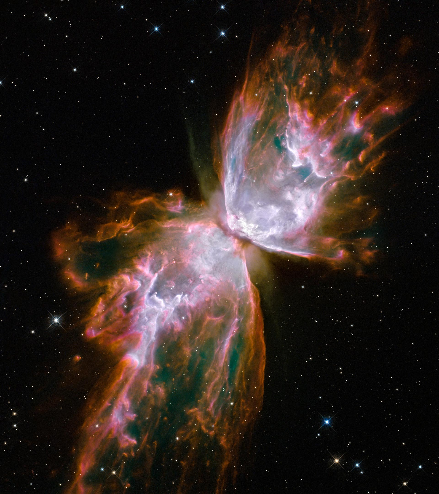

# 🌌 SpaceTing

> An interactive cosmic exploration landing page and Model Context Protocol (MCP) directory inspired by the deep aesthetic of OpenAI's GPT Astra.



---

## ✨ Features

### 1. 🪐 Cinematic 3D Mineral Sand Grain Intro
- **Procedural 3D Quartz Crystal Asset**: Built with `THREE.DodecahedronGeometry` using microscopic organic noise displacement, sharp flat-shaded specular crystal facets, and an internal point light casting warm illumination.
- **Cinematic Camera Choreography**: Camera begins low below the celestial plane tilted up toward the top-left cosmic sky as the solitary sand grain tumbles downward along a 3D curved trajectory.
- **Detonation & Charging Phase**: The grain halts at `(0, 0, 0)`, vibrates with high-frequency tremors, and charges with blinding white-hot starlight energy before shattering.

### 2. 💥 Supernova Blast into Logarithmic Nebula
- **Quartic Ease-Out Explosion**: The detonation triggers an expanding supernova shockwave and flash, propelling 12,500 stars outward along logarithmic spiral vectors with an explosive quartic curve (`76%` expansion within the first 0.45s).
- **Synchronized UI Reveal**: The flanking `GPT` / `Astra` typography and interface remain hidden throughout the detonation, smoothly blooming into view once the galaxy crystallizes.
- **Instant Replay**: Replay the full cinematic intro at any moment via the **`REPLAY`** button in the top HUD or by pressing **`R`**.

### 3. ⭐ Multi-Chromatic 12,500-Star Astrophysical Field
- **Authentic Spectral Palette**: Hydrogen-alpha reds (`#FF2D55`), ionized purples & magentas (`#A855F7`, `#D946EF`), electric blues & cyans (`#00F2FE`, `#38BDF8`), solar oranges (`#FF6B00`, `#FFA94D`), and pure white core stars.
- **High-Dynamic-Range Star Sizing**: Microscopic diamond-dust stars (~80%), medium stars (~14%), supergiant beacons (~4.5%), and mega-giants (~1.5%) featuring procedural 4-point diffraction flares in GLSL fragment shaders.
- **Laminar Fluid Cursor Dynamics**: Cursor behaves like a stick parting glassy still water—smooth lateral displacement, heavy inertial damping (`0.915`), and slow elastic restoration (`0.010`) taking ~2.5–3.5s to settle.

### 4. 🛰️ Model Context Protocol (MCP) Directory
- **Interactive Probes**: Searchable registry of standardized MCP servers (Filesystem, GitHub, PostgreSQL, Brave Search, Memory Graph, Puppeteer, Slack, Sentry, Fetch, Docker, Redis).
- **Client Configuration Generator**: Instant JSON-RPC 2.0 configuration snippets compatible with Anthropic Claude and Cursor.
- **Command Palette (`⌘K` / `Ctrl+K`)**: Fast keyboard navigation across all probes, actions, and observation modes.
- **Ambient Web Audio Synthesizer**: Generative celestial drone, Erik Satie pentatonic chord sequencer, and procedural click chimes.

---

## ⌨️ Keyboard Shortcuts

| Key | Action |
|:---:|:---|
| **`R`** | Replay 3D Sand Grain & Supernova Explosion Intro |
| **`Space`** / **`M`** | Toggle Ambient Celestial Drift Audio |
| **`C`** | Toggle Constellation NOVA Lock vs Spiral Nebula |
| **`U`** / **`V`** | Toggle UI Overlay (Observation Mode) |
| **`⌘K`** / **`Ctrl+K`** | Open Command Palette |
| **`Esc`** | Dismiss Modals & Command Palette |

---

## 🚀 Quick Start

SpaceTing runs as a standalone zero-dependency web application using CDN-hosted Three.js, Tailwind CSS, and Lucide icons.

### Local Preview
```bash
# Clone the repository
git clone https://github.com/Thanukamax/SpaceTing.git
cd SpaceTing

# Run a local HTTP server
python3 -m http.server 3000

# Open in your browser
open http://localhost:3000/index.html
```

---

## 🛠️ Tech Stack
- **Three.js (r128)**: Custom GLSL Shaders, BufferGeometry, Procedural Meshes & Raycasting
- **Web Audio API**: Real-time generative sound synthesis (biquad filters, harmonic oscillators, stereo convolver)
- **Tailwind CSS**: Modern glassmorphism, responsive typography, and micro-interactions
- **Lucide Icons**: Clean minimalist UI iconography

---

## 📄 License
MIT License. Created with passion for cosmic exploration.
